# HealthBridge AI - System Architecture

## Arsitektur Sistem

```mermaid
flowchart TB
    subgraph Internet
        User["👤 Users"]
    end

    subgraph AWS["AWS Cloud"]
        subgraph CDN["CloudFront CDN"]
            CF["🌐 CloudFront"]
        end

        subgraph VPC["VPC"]
            subgraph PublicSubnet["Public Subnet"]
                EC2_FE["🖥️ EC2 Frontend<br/>Nginx + React"]
                EC2_BE["🖥️ EC2 Backend<br/>FastAPI"]
            end

            subgraph PrivateSubnet["Private Subnet"]
                RDS["🗄️ RDS PostgreSQL"]
            end
        end

        S3["📦 S3 Bucket"]
    end

    subgraph External["External Services"]
        Gemini["🤖 Google Gemini AI"]
    end

    User --> CF --> EC2_FE --> EC2_BE
    EC2_BE --> RDS
    EC2_BE --> S3
    EC2_BE --> Gemini
```



---

## 1. Frontend (React/Vite)

| Komponen | Teknologi |
|----------|-----------|
| Framework | React 18 |
| Build Tool | Vite 6 |
| HTTP Client | Axios |
| Styling | Vanilla CSS |
| Container | Nginx Alpine |

### Struktur File
```
healthbridge-frontend-main/
├── src/
│   ├── App.jsx          # Main component (1600+ lines)
│   ├── main.jsx         # Entry point
│   └── index.css        # Styles (2200+ lines)
├── Dockerfile           # Multi-stage build
├── nginx.conf           # Nginx configuration
└── package.json         # Dependencies
```

### Fitur Utama
- 🏠 Landing Page responsif
- 🔐 Authentication (Login/Register)
- 🩺 AI Konsultasi Penyakit
- 📚 Katalog Penyakit (40+ penyakit)
- 💊 Toko Obat dengan galeri gambar
- 🛒 Keranjang Belanja
- 📦 Checkout dengan validasi
- 📋 Tracking Pesanan
- ⚙️ Admin Dashboard lengkap

---

## 2. Backend (FastAPI)

| Komponen | Teknologi |
|----------|-----------|
| Framework | FastAPI |
| Database ORM | SQLAlchemy |
| Auth | JWT (python-jose) |
| Password | bcrypt |
| AI | Google Gemini API |
| PDF | ReportLab |
| AWS | boto3 |

### Struktur File
```
healthbridge-backend-main/
├── main.py              # Main API (2100+ lines)
├── aws_service.py       # AWS S3 integration
├── requirements.txt     # Python dependencies
├── Dockerfile           # Container build
├── .env.example         # Environment template
├── static/images/       # Product images
└── healthbridge.db      # SQLite database
```

### API Endpoints

#### Authentication
| Method | Endpoint | Deskripsi |
|--------|----------|-----------|
| POST | `/api/auth/register` | Register user baru |
| POST | `/api/auth/login` | Login & dapatkan JWT |
| GET | `/api/auth/me` | Get current user |

#### Diseases & Diagnosis
| Method | Endpoint | Deskripsi |
|--------|----------|-----------|
| GET | `/api/diseases` | List semua penyakit |
| POST | `/api/diagnose` | AI diagnosa |

#### Medicines & Images
| Method | Endpoint | Deskripsi |
|--------|----------|-----------|
| GET | `/api/medicines` | List semua obat |
| GET | `/api/images` | List gambar tersedia |
| POST | `/api/upload/image` | Upload gambar produk |

#### Cart & Orders
| Method | Endpoint | Deskripsi |
|--------|----------|-----------|
| POST | `/api/cart/add` | Tambah ke keranjang |
| POST | `/api/order/checkout` | Proses checkout |
| GET | `/api/orders/{phone}` | Riwayat pesanan |

#### Admin (Protected)
| Method | Endpoint | Deskripsi |
|--------|----------|-----------|
| GET | `/api/admin/dashboard` | Statistik |
| GET | `/api/admin/orders` | Semua pesanan |
| PUT | `/api/admin/orders/{id}` | Update status |
| POST | `/api/admin/medicines` | Tambah obat |
| GET | `/api/admin/images-usage` | Mapping gambar-produk |

---

## 3. Database

### Development: SQLite
- File: `healthbridge.db`
- Lokasi: `healthbridge-backend-main/`

### Production: AWS RDS PostgreSQL
- Engine: PostgreSQL 15
- Instance: db.t3.micro
- Multi-AZ: Optional

### Schema


---

## 4. AWS S3

| Folder | Deskripsi |
|--------|-----------|
| `product_images/` | Gambar produk (backup) |
| `orders/` | Order JSON backup |
| `invoices/` | PDF invoices |

### Konfigurasi
```env
AWS_ACCESS_KEY_ID=your_access_key
AWS_SECRET_ACCESS_KEY=your_secret_key
AWS_REGION=ap-southeast-1
AWS_S3_BUCKET=healthbridge-storage
```

---

## 5. Docker

### Backend Dockerfile
```dockerfile
FROM python:3.9-slim
ENV PYTHONDONTWRITEBYTECODE=1
ENV PYTHONUNBUFFERED=1
WORKDIR /app
RUN apt-get update && apt-get install -y curl
COPY requirements.txt .
RUN pip install --no-cache-dir -r requirements.txt
COPY . .
EXPOSE 8000
HEALTHCHECK CMD curl -f http://localhost:8000/ || exit 1
CMD ["uvicorn", "main:app", "--host", "0.0.0.0", "--port", "8000"]
```

### Frontend Dockerfile
```dockerfile
FROM node:20-alpine AS builder
WORKDIR /app
COPY package*.json ./
RUN npm ci
COPY . .
RUN npm run build

FROM nginx:alpine
COPY nginx.conf /etc/nginx/conf.d/default.conf
COPY --from=builder /app/dist /usr/share/nginx/html
EXPOSE 80
CMD ["nginx", "-g", "daemon off;"]
```

### Docker Compose
```bash
# Build & run
docker-compose up -d

# View logs
docker-compose logs -f

# Stop
docker-compose down
```

---

## 6. CDN (CloudFront/Nginx)

### Nginx Cache Config
```nginx
location ~* \.(js|css|png|jpg|jpeg|gif|ico|svg|woff|woff2)$ {
    expires 1y;
    add_header Cache-Control "public, immutable";
}
```

### CloudFront Distribution
- Cache static assets 1 year
- HTTPS redirect
- Gzip compression

---

## 📊 Data Flow


---

## 🔐 Security

- JWT authentication (24h expiry)
- bcrypt password hashing
- CORS configured
- Admin role protection
- Security headers (X-Frame-Options, etc.)

---

## 📋 Summary

| # | Komponen | Teknologi | Status |
|---|----------|-----------|--------|
| 1 | Frontend | React 18 + Vite + Nginx | ✅ |
| 2 | Backend | FastAPI + Python 3.9 | ✅ |
| 3 | Database | SQLite / PostgreSQL RDS | ✅ |
| 4 | Storage | AWS S3 + boto3 | ✅ |
| 5 | Container | Docker + Compose | ✅ |
| 6 | CDN | Nginx Cache / CloudFront | ✅ |
