# HealthBridge AI - AWS Deployment Guide

Panduan lengkap deploy HealthBridge ke AWS dengan **2 EC2 instances** di **public subnet**.

---

## 📋 Prerequisites

Sebelum memulai, pastikan Anda memiliki:
- ✅ AWS Account aktif
- ✅ Credit card terdaftar di AWS
- ✅ Repository GitHub sudah di-clone

---

## 🏗️ Architecture Overview

```mermaid
flowchart TB
    subgraph Internet
        User["👤 User"]
    end

    subgraph AWS["AWS Cloud"]
        subgraph VPC["VPC 10.0.0.0/16"]
            subgraph PublicSubnet["Public Subnet 10.0.1.0/24"]
                EC2_FE["🖥️ EC2 Frontend<br/>Nginx + React<br/>Port 80"]
                EC2_BE["🖥️ EC2 Backend<br/>FastAPI<br/>Port 8000"]
            end
        end

        S3["📦 S3 Bucket<br/>Product Images<br/>Invoices"]

        CF["🌐 CloudFront CDN"]
    end

    User --> CF
    CF --> EC2_FE
    EC2_FE --> EC2_BE
    EC2_BE --> S3
```



### Komponen:
| Komponen | Lokasi | Fungsi |
|----------|--------|--------|
| Frontend EC2 | Public Subnet | Serve React app via Nginx |
| Backend EC2 | Public Subnet | FastAPI + SQLite |
| S3 Bucket | AWS S3 | Penyimpanan gambar & invoice (production) |
| CloudFront | CDN | Cache & HTTPS |

### Catatan Storage:
- **Development**: Gambar disimpan di `static/images/` (lokal)
- **Production**: Gambar disimpan di **S3 Bucket** (cloud)

---

## ⚠️ File yang TIDAK Ada di GitHub

Setelah clone, Anda harus **membuat/install sendiri**:

| File/Folder | Cara Mendapatkan |
|-------------|------------------|
| `node_modules/` | `npm install` |
| `.env` | Buat dari `.env.example` |
| `healthbridge.db` | Otomatis dibuat saat backend jalan |
| `static/images/` | `mkdir -p static/images` |
| `venv/` | `python -m venv venv` |

---

# TAHAP 1: Buat VPC

## 1.1 Buka AWS Console
1. Buka browser → https://console.aws.amazon.com
2. Login dengan akun AWS Anda
3. Pastikan region: **Asia Pacific (Singapore) ap-southeast-1**
   - Klik dropdown region di pojok kanan atas
   - Pilih **Asia Pacific (Singapore)**

## 1.2 Buat VPC Baru
1. Ketik **VPC** di search bar → Klik **VPC**
2. Klik tombol **Create VPC** (tombol oranye)
3. Pilih **VPC only** (bukan "VPC and more")
4. Isi form:
   ```
   Name tag: healthbridge-vpc
   IPv4 CIDR block: 10.0.0.0/16
   IPv6 CIDR block: No IPv6 CIDR block
   Tenancy: Default
   ```
5. Klik **Create VPC**
6. ✅ VPC berhasil dibuat! Catat **VPC ID** (vpc-xxxxxxxx)

## 1.3 Buat Subnet
1. Di sidebar kiri, klik **Subnets**
2. Klik **Create subnet**
3. Isi form:
   ```
   VPC ID: Pilih healthbridge-vpc
   Subnet name: healthbridge-public-subnet
   Availability Zone: ap-southeast-1a
   IPv4 CIDR block: 10.0.1.0/24
   ```
4. Klik **Create subnet**

## 1.4 Buat Internet Gateway
1. Di sidebar kiri, klik **Internet Gateways**
2. Klik **Create internet gateway**
3. Isi form:
   ```
   Name tag: healthbridge-igw
   ```
4. Klik **Create internet gateway**
5. Klik tombol **Actions** → **Attach to VPC**
6. Pilih **healthbridge-vpc** → Klik **Attach internet gateway**

## 1.5 Konfigurasi Route Table
1. Di sidebar kiri, klik **Route Tables**
2. Cari route table yang VPC-nya `healthbridge-vpc` → Klik ID-nya
3. Klik tab **Routes** → **Edit routes**
4. Klik **Add route**:
   ```
   Destination: 0.0.0.0/0
   Target: Internet Gateway → pilih healthbridge-igw
   ```
5. Klik **Save changes**
6. Klik tab **Subnet associations** → **Edit subnet associations**
7. Centang ✅ `healthbridge-public-subnet`
8. Klik **Save associations**

## 1.6 Enable Auto-assign Public IP
1. Klik **Subnets** di sidebar
2. Klik `healthbridge-public-subnet`
3. Klik **Actions** → **Edit subnet settings**
4. Centang ✅ **Enable auto-assign public IPv4 address**
5. Klik **Save**

---

# TAHAP 2: Buat Security Groups

## 2.1 Security Group Frontend
1. Buka **EC2** (ketik di search bar)
2. Di sidebar kiri, klik **Security Groups**
3. Klik **Create security group**
4. Isi form:
   ```
   Security group name: healthbridge-frontend-sg
   Description: Security group for frontend
   VPC: healthbridge-vpc
   ```
5. **Inbound rules** → Klik **Add rule** 3x:

   | Type | Port | Source | Description |
   |------|------|--------|-------------|
   | HTTP | 80 | 0.0.0.0/0 | Web access |
   | HTTPS | 443 | 0.0.0.0/0 | Secure web |
   | SSH | 22 | My IP | Admin SSH |

6. Klik **Create security group**

## 2.2 Security Group Backend
1. Klik **Create security group** lagi
2. Isi form:
   ```
   Security group name: healthbridge-backend-sg
   Description: Security group for backend
   VPC: healthbridge-vpc
   ```
3. **Inbound rules** → Klik **Add rule** 2x:

   | Type | Port | Source | Description |
   |------|------|--------|-------------|
   | Custom TCP | 8000 | 0.0.0.0/0 | API access |
   | SSH | 22 | My IP | Admin SSH |

4. Klik **Create security group**

---

# TAHAP 3: Buat Key Pair

1. Di sidebar EC2, klik **Key Pairs**
2. Klik **Create key pair**
3. Isi form:
   ```
   Name: healthbridge-key
   Key pair type: RSA
   Private key file format: .pem
   ```
4. Klik **Create key pair**
5. ⚠️ **PENTING**: File `healthbridge-key.pem` akan terdownload otomatis
6. Simpan file ini di tempat aman! Tidak bisa didownload ulang!

---

# TAHAP 4: Launch EC2 Frontend

## 4.1 Buat Instance
1. Di sidebar EC2, klik **Instances**
2. Klik **Launch instances**
3. Isi form:

   **Name:**
   ```
   healthbridge-frontend
   ```

   **Application and OS Images:**
   - Klik **Ubuntu**
   - Pilih **Ubuntu Server 22.04 LTS (Free tier eligible)**

   **Instance type:**
   - Pilih **t2.micro** (Free tier eligible)

   **Key pair:**
   - Pilih **healthbridge-key**

   **Network settings:** Klik **Edit**
   ```
   VPC: healthbridge-vpc
   Subnet: healthbridge-public-subnet
   Auto-assign public IP: Enable
   Firewall: Select existing security group
   Security groups: healthbridge-frontend-sg
   ```

   **Configure storage:**
   - 8 GiB gp2 (default)

4. Klik **Launch instance**

## 4.2 Catat Public IP
1. Tunggu instance berstatus **Running**
2. Klik instance → Catat **Public IPv4 address**
   ```
   Contoh: 54.123.45.67
   ```

---

# TAHAP 5: Launch EC2 Backend

Ulangi langkah TAHAP 4 dengan perbedaan:

```
Name: healthbridge-backend
Security group: healthbridge-backend-sg
```

Catat **Public IPv4 address** backend:
```
Contoh: 54.234.56.78
```

---

# TAHAP 6: Setup S3 Bucket

## 6.1 Buat Bucket
1. Ketik **S3** di search bar → Klik **S3**
2. Klik **Create bucket**
3. Isi form:
   ```
   Bucket name: healthbridge-storage-UNIQUE-ID
   (Ganti UNIQUE-ID dengan angka random, misal: healthbridge-storage-12345)
   
   AWS Region: Asia Pacific (Singapore) ap-southeast-1
   ```
4. **Object Ownership**: ACLs disabled (recommended)
5. **Block Public Access**: 
   - ❌ Uncheck "Block all public access"
   - ✅ Centang "I acknowledge..."
6. Klik **Create bucket**

## 6.2 Buat Folder di Bucket
1. Klik bucket yang baru dibuat
2. Klik **Create folder**
3. Buat folder:
   - `product_images/`
   - `invoices/`
   - `orders/`

## 6.3 Set Bucket Policy (Public Read untuk Images)
1. Klik tab **Permissions**
2. Scroll ke **Bucket policy** → Klik **Edit**
3. Paste policy ini (ganti BUCKET-NAME):
```json
{
    "Version": "2012-10-17",
    "Statement": [
        {
            "Sid": "PublicReadProductImages",
            "Effect": "Allow",
            "Principal": "*",
            "Action": "s3:GetObject",
            "Resource": "arn:aws:s3:::BUCKET-NAME/product_images/*"
        }
    ]
}
```
4. Klik **Save changes**

## 6.4 Buat IAM User untuk S3
1. Ketik **IAM** di search bar → Klik **IAM**
2. Klik **Users** → **Create user**
3. Isi:
   ```
   User name: healthbridge-s3-user
   ```
4. Klik **Next**
5. Pilih **Attach policies directly**
6. Cari dan centang: **AmazonS3FullAccess**
7. Klik **Next** → **Create user**
8. Klik user yang baru dibuat
9. Klik tab **Security credentials**
10. Scroll ke **Access keys** → **Create access key**
11. Pilih **Application running outside AWS**
12. Klik **Create access key**
13. ⚠️ **PENTING**: Catat atau download:
    ```
    Access key ID: AKIAXXXXXXXXXXXXXXXXX
    Secret access key: xxxxxxxxxxxxxxxxxxxxxxxxxxxxxxxxxxxxxxxx
    ```

---

# TAHAP 7: Setup Frontend Server

## 7.1 Connect SSH
```bash
# Linux/Mac:
chmod 400 healthbridge-key.pem
ssh -i healthbridge-key.pem ubuntu@FRONTEND_IP

# Windows PowerShell:
ssh -i healthbridge-key.pem ubuntu@FRONTEND_IP
```
Ganti `FRONTEND_IP` dengan IP frontend (contoh: 54.123.45.67)

## 7.2 Install Docker
```bash
# Update system
sudo apt update && sudo apt upgrade -y

# Install Docker
curl -fsSL https://get.docker.com -o get-docker.sh
sudo sh get-docker.sh

# Add user to docker group
sudo usermod -aG docker ubuntu

# PENTING: Logout dan login kembali
exit
```

## 7.3 SSH Kembali
```bash
ssh -i healthbridge-key.pem ubuntu@FRONTEND_IP
```

## 7.4 Clone Repository
```bash
git clone https://github.com/subagja033010/healthbridge.git
cd healthbridge/healthbridge-frontend-main
```

## 7.5 Edit API URL
```bash
nano src/App.jsx
```

Cari baris:
```javascript
const API_URL = "http://127.0.0.1:8000";
```

Ganti menjadi (gunakan IP backend Anda):
```javascript
const API_URL = "http://BACKEND_IP:8000";
```

Simpan: `Ctrl+X` → `Y` → `Enter`

## 7.6 Build & Run
```bash
# Build Docker image
docker build -t healthbridge-frontend .

# Run container
docker run -d \
  --name frontend \
  -p 80:80 \
  --restart unless-stopped \
  healthbridge-frontend

# Verify
docker ps
```

## 7.7 Test
Buka browser: `http://FRONTEND_IP`

---

# TAHAP 8: Setup Backend Server

## 8.1 Connect SSH
```bash
ssh -i healthbridge-key.pem ubuntu@BACKEND_IP
```

## 8.2 Install Docker
```bash
sudo apt update && sudo apt upgrade -y
curl -fsSL https://get.docker.com -o get-docker.sh
sudo sh get-docker.sh
sudo usermod -aG docker ubuntu
exit
```

## 8.3 SSH Kembali
```bash
ssh -i healthbridge-key.pem ubuntu@BACKEND_IP
```

## 8.4 Clone Repository
```bash
git clone https://github.com/subagja033010/healthbridge.git
cd healthbridge/healthbridge-backend-main
```

## 8.5 Buat File .env
```bash
nano .env
```

Isi dengan kredensial Anda:
```env
# JWT Authentication
SECRET_KEY=ganti-dengan-random-string-yang-panjang-dan-aman

# Google Gemini AI (untuk diagnosis AI)
GEMINI_API_KEY=your-gemini-api-key

# Database (SQLite untuk production sederhana)
DATABASE_URL=sqlite:///./healthbridge.db

# AWS S3 (untuk menyimpan gambar di production)
AWS_ACCESS_KEY_ID=AKIAXXXXXXXXXXXXXXXXX
AWS_SECRET_ACCESS_KEY=xxxxxxxxxxxxxxxxxxxxxxxxxxxxxxxxxxxxxxxx
AWS_REGION=ap-southeast-1
AWS_S3_BUCKET=healthbridge-storage-UNIQUE-ID
```

Simpan: `Ctrl+X` → `Y` → `Enter`

## 8.6 Edit CORS di main.py
```bash
nano main.py
```

Cari bagian `allow_origins` dan tambahkan IP frontend:
```python
allow_origins=[
    "http://localhost:5173",
    "http://localhost:3000",
    "http://FRONTEND_IP",  # Tambahkan ini
],
```

Simpan: `Ctrl+X` → `Y` → `Enter`

## 8.7 Buat Folder Static
```bash
mkdir -p static/images
```

## 8.8 Build & Run
```bash
# Build Docker image
docker build -t healthbridge-backend .

# Run container
docker run -d \
  --name backend \
  -p 8000:8000 \
  -v $(pwd)/static:/app/static \
  -v $(pwd)/healthbridge.db:/app/healthbridge.db \
  --env-file .env \
  --restart unless-stopped \
  healthbridge-backend

# Verify
docker ps
docker logs backend
```

## 8.9 Test API
```bash
curl http://localhost:8000/
# Output: {"message":"Welcome to HealthBridge AI API"}
```

---

# TAHAP 9: Setup CloudFront (CDN)

## 9.1 Buat Distribution
1. Ketik **CloudFront** di search bar
2. Klik **Create distribution**
3. **Origin:**
   ```
   Origin domain: FRONTEND_IP (IP frontend Anda)
   Protocol: HTTP only
   ```
4. **Default cache behavior:**
   ```
   Viewer protocol policy: Redirect HTTP to HTTPS
   Allowed HTTP methods: GET, HEAD
   Cache policy: CachingOptimized
   ```
5. **Settings:**
   ```
   Price class: Use only North America and Europe
   ```
6. Klik **Create distribution**
7. Tunggu status **Deployed** (5-15 menit)
8. Catat **Distribution domain name**:
   ```
   Contoh: d1234abcd.cloudfront.net
   ```

---

# TAHAP 10: Verifikasi

## 10.1 Test Frontend
1. Buka `http://FRONTEND_IP`
2. Atau `https://d1234abcd.cloudfront.net`
3. Pastikan halaman landing muncul

## 10.2 Test Login Admin
1. Klik **Masuk**
2. Login dengan:
   ```
   Email: admin@healthbridge.com
   Password: admin123
   ```
3. Pastikan dashboard admin muncul

## 10.3 Test Upload Gambar
1. Di Admin → Produk → Edit produk
2. Upload gambar baru
3. Verifikasi gambar muncul
4. Cek S3 bucket → folder `product_images/`

## 10.4 Test Konsultasi AI
1. Klik **Konsultasi**
2. Masukkan gejala
3. Verifikasi AI memberikan diagnosis

---

# 💰 Estimasi Biaya (Per Bulan)

| Service | Spec | Biaya (USD) |
|---------|------|-------------|
| EC2 t2.micro (2x) | 730 jam | $0 (Free Tier) |
| S3 Storage | 5GB | $0.12 |
| CloudFront | 50GB transfer | $4.25 |
| Data Transfer | 10GB | $0.90 |
| **TOTAL** | | **~$5-10/bulan** |

> 💡 **Free Tier**: EC2 gratis 750 jam/bulan selama 12 bulan pertama

---

# 🔧 Maintenance

## View Logs
```bash
docker logs -f frontend
docker logs -f backend
```

## Restart
```bash
docker restart frontend
docker restart backend
```

## Update Aplikasi
```bash
# Frontend
cd healthbridge/healthbridge-frontend-main
git pull
docker stop frontend && docker rm frontend
docker build -t healthbridge-frontend .
docker run -d --name frontend -p 80:80 --restart unless-stopped healthbridge-frontend

# Backend
cd healthbridge/healthbridge-backend-main
git pull
docker stop backend && docker rm backend
docker build -t healthbridge-backend .
docker run -d --name backend -p 8000:8000 -v $(pwd)/static:/app/static -v $(pwd)/healthbridge.db:/app/healthbridge.db --env-file .env --restart unless-stopped healthbridge-backend
```

---

# 🚨 Troubleshooting

## Container tidak jalan
```bash
docker logs backend
docker logs frontend
```

## CORS Error di browser
Pastikan IP frontend ada di `allow_origins` di `main.py`

## Tidak bisa SSH
- Cek Security Group port 22 terbuka
- Cek file .pem permission: `chmod 400 healthbridge-key.pem`

## Gambar tidak muncul
- Cek S3 bucket policy sudah benar
- Cek AWS credentials di .env sudah benar
- Cek folder `static/images/` ada

## API Error 500
```bash
docker logs backend
```
Biasanya masalah database atau environment variables
