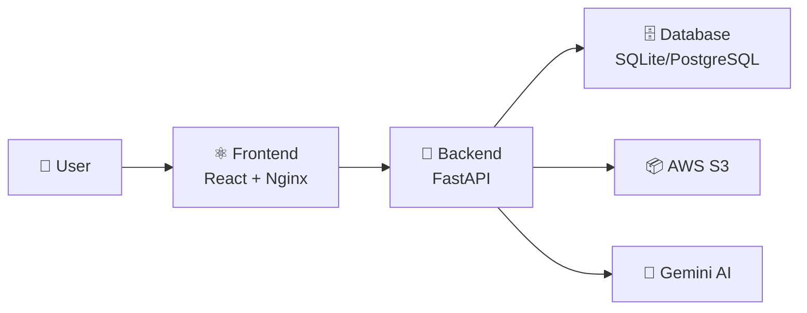

# HealthBridge AI

Platform kesehatan digital dengan konsultasi AI dan e-commerce obat.

---

## 🏥 Tentang Aplikasi

HealthBridge AI adalah aplikasi web yang menyediakan:
- **Konsultasi AI** - Diagnosis penyakit berbasis kecerdasan buatan (Google Gemini)
- **Katalog Penyakit** - Informasi 40+ penyakit dengan gejala dan pengobatan
- **Toko Obat Online** - Beli obat dengan mudah dan aman
- **Admin Dashboard** - Kelola produk, pesanan, dan pengguna

---

## 🏗️ Arsitektur Sistem



| Komponen | Teknologi | Port |
|----------|-----------|------|
| Frontend | React 18 + Vite + Nginx | 80/5173 |
| Backend | FastAPI + Python 3.9 | 8000 |
| Database | SQLite (dev) / PostgreSQL RDS (prod) | 5432 |
| Storage | AWS S3 | - |
| Container | Docker + docker-compose | - |

---

## 📁 Struktur Project

```
healthbridge/
├── healthbridge-frontend-main/    # React Frontend
│   ├── src/
│   │   ├── App.jsx               # Main component
│   │   └── index.css             # Styles
│   ├── Dockerfile
│   ├── nginx.conf
│   └── package.json
│
├── healthbridge-backend-main/     # FastAPI Backend
│   ├── main.py                   # Main API (2100+ lines)
│   ├── aws_service.py            # S3 integration
│   ├── requirements.txt
│   ├── Dockerfile
│   ├── .env.example
│   └── static/images/
│
├── docker-compose.yml
├── README.md                      # This file
├── ARCHITECTURE.md                # System architecture
├── AWS_DEPLOY.md                  # AWS deployment guide
└── MANUAL_GUIDE.md                # Installation guide
```

---

## 🚀 Quick Start

### Local Development

**Backend:**
```bash
cd healthbridge-backend-main
pip install -r requirements.txt
uvicorn main:app --reload
```

**Frontend:**
```bash
cd healthbridge-frontend-main
npm install
npm run dev
```

### Docker
```bash
docker-compose up -d
```

**Akses:**
- Frontend: http://localhost:5173 (dev) / http://localhost:3000 (docker)
- Backend API: http://localhost:8000
- API Docs: http://localhost:8000/docs

---

## 🔐 Akun Default

| Role | Email | Password |
|------|-------|----------|
| Admin | admin@healthbridge.com | admin123 |

---

## 📚 Dokumentasi

| Dokumen | Deskripsi |
|---------|-----------|
| [ARCHITECTURE.md](ARCHITECTURE.md) | Arsitektur sistem lengkap dengan Mermaid diagrams |
| [AWS_DEPLOY.md](AWS_DEPLOY.md) | Tutorial deploy ke AWS (EC2 + RDS + S3 + CloudFront) |
| [MANUAL_GUIDE.md](MANUAL_GUIDE.md) | Panduan instalasi dan penggunaan |

---

## 🔧 Environment Variables

Buat file `.env` di `healthbridge-backend-main/`:

```env
SECRET_KEY=your-jwt-secret-key
GEMINI_API_KEY=your-gemini-api-key
DATABASE_URL=sqlite:///./healthbridge.db
AWS_ACCESS_KEY_ID=your-aws-key
AWS_SECRET_ACCESS_KEY=your-aws-secret
AWS_REGION=ap-southeast-1
AWS_S3_BUCKET=healthbridge-storage
```

---

## 📞 Support

Email: support@healthbridge.com
